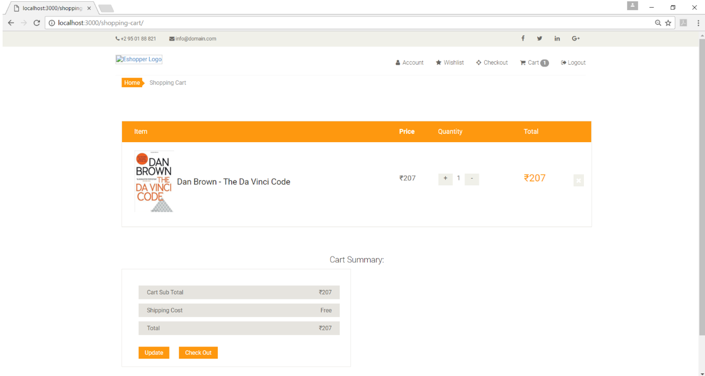

# shoppingKart

This is an E-Commerce Application developed using Node.js & MongoDB 

To open this project,

1. Clone the Repository

2. Install all dependencies using npm install command

3. Type the npm start command to start the server

4. Application starts in the the browser under the address localhost://3000 or any free port available in the PC  

## Welcome Page of ShoppingKart

## Cart Page

## Checkout Page

## Profile Page

## Signin Page

